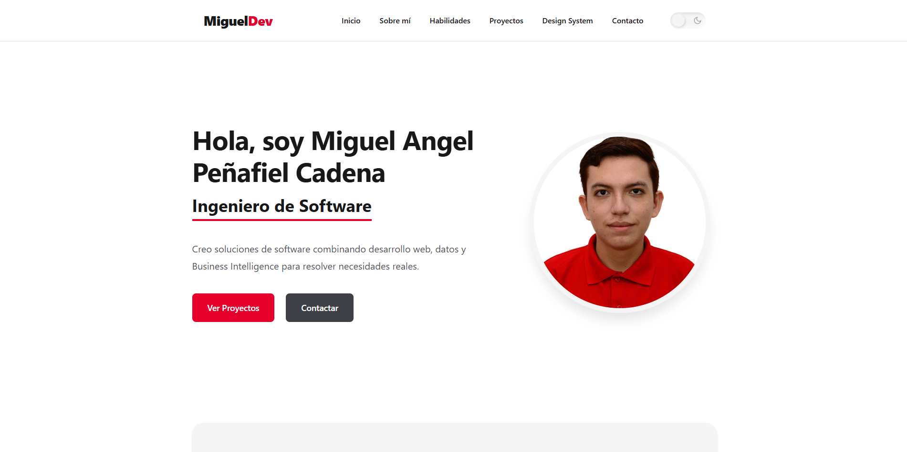
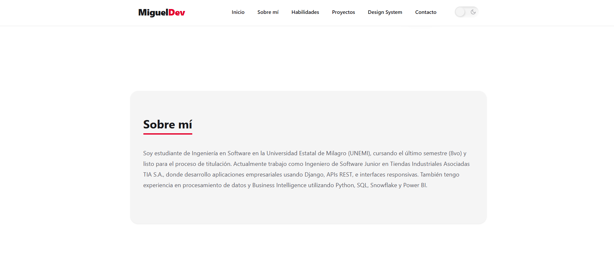
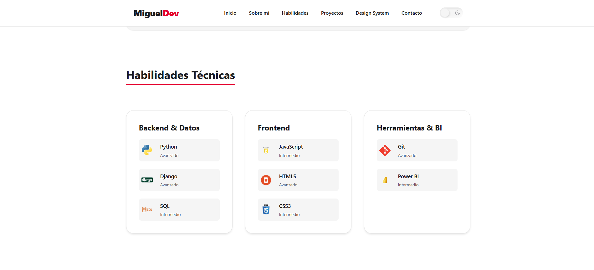
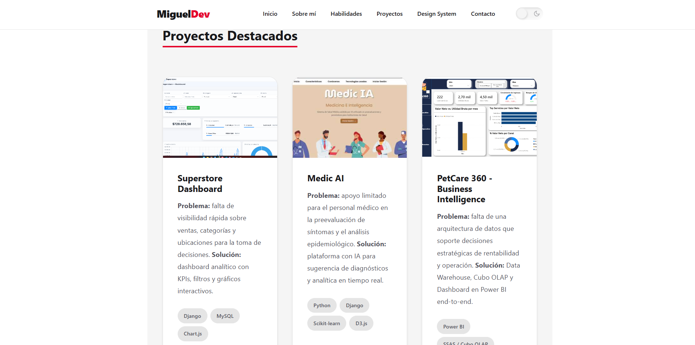
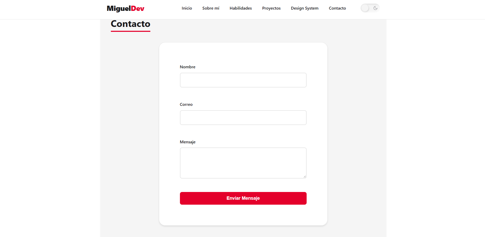

# Portafolio Web - Miguel Angel Peñafiel Cadena

Portafolio personal e interactivo desarrollado como prueba técnica / tarea académica, aplicando HTML5 semántico, CSS3 (Custom Properties) y JavaScript vanilla.

## Contenido

- Inicio / Presentación
- Sobre mí
- Habilidades técnicas
- Proyectos destacados
- Design System / Componentes
- Contacto

## Tecnologías utilizadas

- HTML5 semántico
- CSS3 (Custom Properties, Flexbox, Grid, Media Queries)
- JavaScript (Vanilla JS, sin frameworks)

## Funcionalidades

- Menú de navegación responsive
- Modo claro / oscuro con persistencia en localStorage
- Modal interactivo con el detalle de cada proyecto
- Validación de formulario de contacto en tiempo real
- Botón "Volver arriba"
- Diseño responsive (móvil, tablet y escritorio)

## Demo en vivo

Puedes visualizar el portafolio web desplegado en GitHub Pages:

[Ver portafolio en vivo](https://mpenafielc5.github.io/DW_S2TAREA1/)

## Resultados

Capturas del portafolio web desarrollado:

### Inicio



### Sobre mí



### Habilidades



### Proyectos



### Contacto



## Estructura del proyecto

```
├── index.html
├── css/
│   └── styles.css
├── js/
│   └── script.js
└── assets/
    └── img/
        ├── profile/
        ├── icons/
        └── projects/
```

## Cómo visualizarlo

1. Clona este repositorio.
2. Abre index.html en tu navegador.

## Contacto

- Email: mpenafielc5@unemi.edu.ec
- GitHub: https://github.com/mpenafielc5
- LinkedIn: https://www.linkedin.com/in/miguexang/
